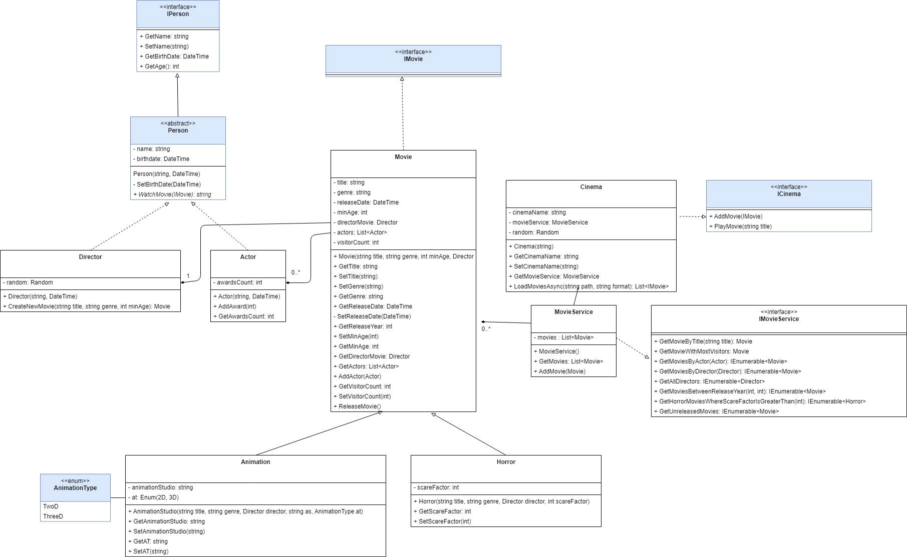

Voor- en familienaam:
---

Opleiding **Graduaat programmeren**
---

Opleidingsonderdeel **Programming expert (PRE)**
---

Lector: Tibo Van Craenenbroeck&nbsp;&nbsp;&nbsp;&nbsp;&nbsp;&nbsp;&nbsp;&nbsp;&nbsp;&nbsp;Nagelezen door:
---

Academiejaar **2024-2025 – JH1**&nbsp;&nbsp;&nbsp;&nbsp;&nbsp;&nbsp;&nbsp;&nbsp;&nbsp;&nbsp;&nbsp;trajectschijf 1
---

Datum en uur **08/01/2025 - 13.30 uur**&nbsp;&nbsp;&nbsp;&nbsp;&nbsp;&nbsp;&nbsp;&nbsp;&nbsp;&nbsp;&nbsp;&nbsp;&nbsp;&nbsp;&nbsp;&nbsp;&nbsp;&nbsp;&nbsp;&nbsp;&nbsp;&nbsp;&nbsp;&nbsp;&nbsp;&nbsp;&nbsp;&nbsp;&nbsp;&nbsp;&nbsp;&nbsp;&nbsp;&nbsp;&nbsp;&nbsp;&nbsp;&nbsp;Eerste examenkans
---

**EXAMEN**

# Algemene instructies examen 

- Dit examen maakt 70% uit van de evaluatie voor de module PRE
- Schrijf je voornaam en familienaam bovenaan dit document 
- Lees aandachtig de opdracht door bij de start van het examen 
-  Teken af op de aanwezigheidslijst 
- Er mag geen enkele AI tool (chatGPT, Copilot, IntelliCode, ...) gebruikt worden voor dit examen. Het ongeoorloofd gebruik van AI leidt automatisch tot het opstarten van een fraudedossier volgens het onderwijs en examenreglement, wat kan leiden tot een nulscore op 1 of meer opleidingsonderdelen. 

- Het gebruik van het impliciete var  data-type is niet toegestaan. Je kiest steeds een passend type voor je variabelen, retourwaarden ... (int, string, Person ...)

Iedere vaststelling van onregelmatigheid (o.a. GSM, spieken, ...) wordt conform het OER gemeld aan de betrokken student en aan de voorzitter van de examencommissie. 

Veel succes!
# EE Cinema
## Doelstellingen
- Delegates en lambda expressies
- Linq queries
- Klassendiagrammen (UML)
- Design patterns
- Extension methods
- Events (incl. eigen events)
- Streams (IO) en asynchroon programmeren

## UML-schema

## Uitwerking
### Algemeen
Het klassendiagram moet exact nagemaakt worden op basis van de geziene leerstof. 

### Klassen
#### Puntenverdeling

| Naam | Punten |
| --- | --- |
| Klassen + interfaces (niet gekleurde klassen) | 1.5 |
| Alle klassen + interfaces (inclusief gekleurde klassen + enums) | 0.5 |
|Properties (niet gekleurde klassen) | 3 |
| Properties (inclusief gekleurde klassen) | 1 |

**Deze punten worden omgerekend.**

### DLL
In het project 'Pre.EE-movies.DLL' is een DLL aanwezig die de blauwe klassen, interfaces en enums uit het klassendiagram bevat.

Deze elementen hoef je dus niet zelf na te bouwen, maar kun je gebruiken door de DLL te importeren.

Het implementeren van de gekleurde klassen, interfaces en enums kan leiden tot een hogere score (zie puntenverdeling).

### Properties en methodes
#### Person (= een gekleurde klasse)
- De geboortedatum van een persoon mag niet in de toekomst liggen.

#### Director
##### CreateNewMovie
Deze methode creëert een nieuwe film en geeft deze terug. 50% van de films die de regisseur maakt, zijn animatiefilms. De overige 50% zijn horrorfilms.

##### WatchMovie
Deze methode toont het volgende bericht aan de gebruiker: "Director DIRECTORNAME is watching MOVIE".

#### Actor
##### WatchMovie
Deze methode toont het volgende bericht aan de gebruiker: "Actor ACTORNAME is watching MOVIE and he/she has NR_AWARDS awards".

##### AddAward
Het aantal awards mag niet negatief zijn en moet groter zijn dan nul.

#### Movie
##### ReleaseMovie
Deze methode zet de ReleaseDate op de huidige datum en tijd. Indien de film reeds uitgebracht is, moet er een exception teruggegeven worden: "The movie has already been released.".

##### SetVisitorCount
Het aantal bezoekers kan nooit kleiner zijn dan 0 en het kan nooit kleiner zijn dan het vorige aantal bezoekers.

##### Sorteren
Films moeten gesorteerd worden op basis van hun releaseYear.

#### Horror
##### Scare-factor
De Scare-factor is een waarde tussen 0 en 10.

#### MovieService
##### AddMovie
Een film kan pas toegevoegd worden als de film reeds gereleased is en als de film nog niet in de lijst van "movies" staat.
Een film is hetzelfde als de volgende zaken overeenkomen:
- Naam van de film;
- Datum van release;
- Regisseur;
- Genre.

Gebruik hiervoor de meest passende manier.

#### Cinema
##### PlayMovie
Deze methode toont het volgende bericht aan de gebruiker: "TITLE - DIRECTOR: Actors: ACTOR1, ACTOR2 ... - Number of visitors: NUMBEROFVISITORS".

Een film kan enkel bekeken worden als deze reeds gepubliceerd is.

Het aantal bezoekers is een willekeurig getal tussen 1 en 100. Voeg dit aantal toe aan het totaal aantal bezoekers van die bepaalde film.

### Extension Methods
#### Puntenverdeling
| Naam | Score |
| --- | --- |
| GetAnimationMovies | 2.5 |
| GetHorrorMovies | 0.5 |
| GetAllAnimationStudios | 0.5 |
| GetAllAnimationMoviesByAnimationType | 0.5 |

**Deze punten worden omgerekend naar een score op vijf.**
#### Movie Extensions
##### GetAnimationMovies
Deze methode geeft alle animatiefilms terug van een lijst van animatiefilms.

##### GetHorrorMovies
Deze methode geeft alle horrorfilms terug.

#### Animation Extensions
##### GetAllAnimationStudios
Deze methode geeft alle animatiestudio's terug.

##### GetAllAnimationMoviesByAnimationType
Deze methode geeft alle animatiefilms terug van een bepaald type (bijvoorbeeld: 3D, 2D).

### Events
#### Puntenverdeling
| Naam | Score |
| --- | --- |
| PlayMovieEvent | 2 |
| GiveAwardEvent | 0.5 |
| NewMovieEvent | 0.5 |

#### GiveAwardEvent
Indien een film meer dan 250 bezoekers lokt, moet er een event getriggerd worden dat ervoor zorgt dat alle acteurs die in die bepaalde film meespeelden, een award krijgen.

De methode moet in de klasse "Cinema" zelf staan.

#### NewMovieEvent
Dit event wordt getriggerd wanneer er een nieuwe film aan de cinema wordt toegevoegd. Het event plaatst in de console-applicatie de volgende zin: "CINEMANAME: New movie: TITLE - RELEASEDATE!!!".
De methode in de klasse "Movie" wordt in dit event aangesproken.

Maak hiervoor gebruik van een zelfgemaakte EventArgs waarin de film en de cinema meegestuurd kunnen worden.
Plaats de methode van dit event in de klasse "Movie".

#### PlayMovieEvent
Bij het afspelen van een film worden verschillende methodes getriggerd:
- ShowAds: Deze methode toont het volgende bericht in de console: "Show ad for movie: MOVIENAME. Starttime: STARTTIME". (STARTTIME = Tijdstip op dit moment).
- SellFood: Deze methode toont het volgende bericht in de console: "Sell food for movie: MOVIENAME. Starttime: STARTTIME".

Beide methodes maken gebruik van de PlayMovieEventArgs. Deze EventArgs bevat de naam van de film en de starttijd.

### IO
#### LoadMoviesAsync
Deze methode laadt alle films in vanuit een bestand. De films moeten in een lijst van films worden opgeslagen (= in de klasse Cinema zelf).
Zorg ervoor dat de methode asynchroon werkt.

TIP: Hiervoor is een aanpassing aan de interface "ICinema" nodig.

### Testen
Zorg ervoor dat alle code getest wordt. Maak hiervoor gebruik van een console-applicatie.
Zorg ervoor dat er van elke klasse een nuttige afdruk gemaakt kan worden.

## Puntenverdeling

| Naam | Punten |
| --- | --- |
| Linq queries | 5 |
| Klassen + interfaces | 2 |
| Properties | 5 |
| Methodes | 5 |
| Events | 5 |
| Extension methods | 5 |
| Streams (IO) | 5 |
| Asynchroon programmeren | 2 |
| Testen | 2 |